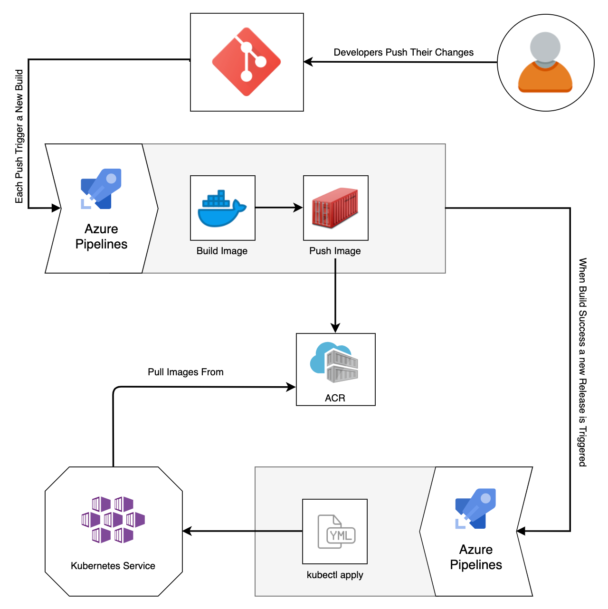

# Weight Tracker K8s CI-CD



# About:

Deploy **Weight Tracker** app to **Kubernetes** cluster using **Helm** and **Azure DevOps**.

## CI-CD process:

### Continuous Integration:
* Developers push their changes
* Each push triggers a new build 
* Dock image is created and uploaded to the ACR
* When build success new a Release is Triggered.

### Continuous Deployment   
 
* Deployment for staging environment
* Helm chart package is pulled from the Acr and gets installed on the cluster

### Continuous Delivery
* Deployment for production environment using helm after review and approval


## Configuration
1. Provision of an AKS cluster for staging and production environments
2. Install the Nginx ingress controller and use it to expose the application.
3. Create a Helm chart for the web tracker app.

### Weight Tracker chart files:
```
├── appchart
│   ├── Chart.yaml
│   ├── templates
│   │   ├── configmap.yaml
│   │   ├── deployment.yaml
│   │   ├── ingress.yaml
│   │   ├── secret_provider_class.yaml
│   │   └── service.yaml
│   └── values.yaml
```
4. Azure key vault is used to store the secrets for the helm chart
5. Configmap is used to store the application configurations

5. Create a Postgres Data Base helm chart.
### Postgres chart files:

```
postgres_chart
    ├── Chart.yaml
    ├── templates
    │   ├── deployment.yaml
    │   ├── postgres-storage.yaml
    │   └── service.yaml
    └── values.yaml
```
